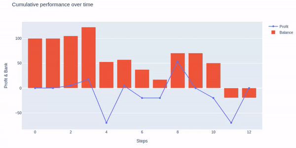
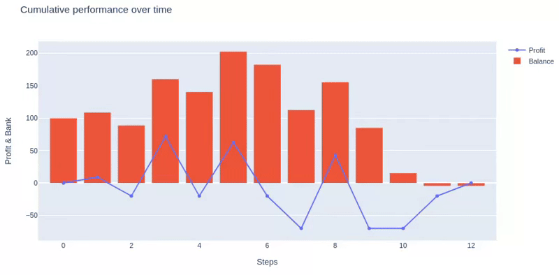

betting_env
================

<!-- WARNING: THIS FILE WAS AUTOGENERATED! DO NOT EDIT! -->

## Install

``` sh
pip install betting_env
```

## Test environment

Assuming We have `$N` (N\>0) in our Bank account and would want to place
some bets on several `football` games.

The `bettor` can play on two alternative betting forms: `1X2` and
`Asian handicap` by placing a `small`, `medium`, or `big` stake size of
his current balance on `home team win`, `away team win`, or `draw` (1X2
case). In this custom environment, the `agent` is placing ,in each step,
a wager on a `single game`, is informed of the `game` information, and
receives a `reward` (Profit) that might be `positive` or `negative`.

It should be noted that the `agent` quits betting after he has played
all of the supplied `games` or has lost all of the `money`.

### Load games

``` python
# Initialise connections.
mongo_init("prod_atlas")
# Get all fixtures.
fixtures = Fixture.get_all_fixtures()
# Fixtures.
fixtures = pd.DataFrame(fixtures.as_pymongo())
```

### Init environment

``` python
env = BettingEnv(fixtures)
max_steps_limit = fixtures.shape[0]
```

### Playing random choices

``` python
# Init RL env.
env.reset()
# Init done Flag to False.
done = False
# Init loop counter.
i = 0
# Stops when it is done or when we have bet on all provided games.
while not done and i < max_steps_limit:
    # Make a step.
    obs, reward, done, info = env.step(env.action_space.sample())
    # Increment counter.
    i = i + 1
# Display graph.
env.render()
env.fig.update_layout(hovermode="x")
figure = Image.open("../images/img_1.gif")
display(figure)
#figure = env.fig.to_image(format="png")
#Image(figure)
```



``` python
HTML('')
```


``` python
HTML('')
```


### Playing Medium Stake on Home Team Win (1X2)

``` python
# Init RL env.
env.reset()
# Init done Flag to False.
done = False
# Init loop counter.
i = 0
# Stops when it is done or when we have bet on all provided games.
while not done and i < max_steps_limit:
    # Make a step.
    obs, reward, done, info = env.step(2)
    # Increment counter.
    i = i + 1
# Display graph.
env.render()
env.fig.update_layout(hovermode="x")
figure = env.fig.to_image(format="png")
#Image(figure)
```


